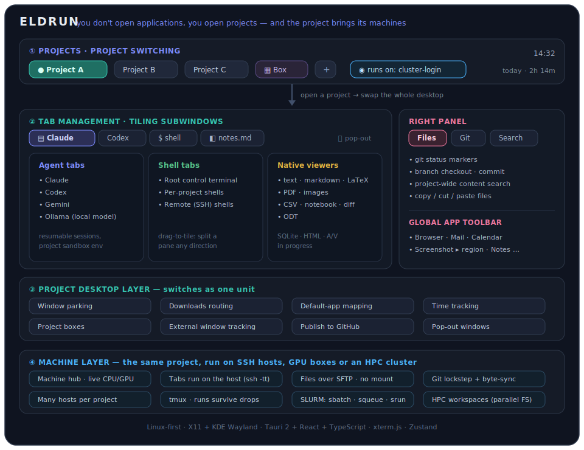

# Eldrun

> **You don't open applications — you open projects.**
> Eldrun is a project-centric desktop layer that swaps your whole working
> context as one unit, with AI agent terminals and in-app file viewers built in.

Eldrun is a **project-centric desktop layer**, not just an app that launches or
embeds other apps: projects own their windows and desktop context, and selecting
a project swaps that whole context — windows, files, apps, Git state, and layout
— as a single unit. The AI agent terminals, file viewers, and app launcher ride
on top, living *inside* a project once its desktop is restored. Built with
**Tauri 2 + React + TypeScript**. Linux (X11 / KDE Wayland) and Windows both get
native workspace, app-launch, default-app, and download integration today; macOS
runs as a shell with a no-op workspace backend (on the roadmap).

---

## Why Eldrun

When you juggle several projects at once, every project's windows — browsers,
terminals, file managers, docs, agents — pile onto one desktop. Switching from
project A to project B means digging through dozens of windows for the handful
that belong where you're going, and losing the rest in the noise.

Eldrun flips the model. **Select a project, and the desktop becomes that
project:** its windows come forward, the previous project's windows park out of
the way, the downloads folder and default-app mappings re-route, and time
tracking switches. One project visible at a time, everything else cleanly out of
sight.

Inside a project, Eldrun is an operational cockpit — a root control terminal for
the workspace, agent terminals scoped to the project (Claude, Codex, Gemini, or
a local Ollama model), a tiling tab layout, a hover-revealed file panel with
built-in viewers, and cross-project app controls that follow you between
projects.

## Vision

> Select a project → Eldrun restores its complete working context.

A project's context already spans terminals, files, apps, windows, Git state,
and layout; the direction of travel adds notes, AI/task metadata, and workflow
state, so a project carries everything it needs to be resumed exactly where you
left it.

The implementation runs natively on **Linux (X11 and KDE Wayland)** and
**Windows** today — both with real per-project window parking — and the design is
cross-platform by intent. The long-term shape is a stable Eldrun core behind
pluggable compositor/window backends (X11, KDE/KWin, Hyprland, GNOME Shell, i3,
Sway, and other Wayland environments; the Win32 backend on Windows), native macOS
support, and eventually an Eldrun-native compositor for full control of projects,
windows, and layout.

See [VISION.md](docs/VISION.md) for the full strategy and platform rationale.

## At a glance



**①** pick a project and the desktop swaps to it. **②** inside, a tiling tab
layout hosts agent terminals, shells, and native file viewers. **③** the
project-desktop layer (window parking, downloads, default apps, time tracking)
follows the active project automatically, with the right panel (Files · Git ·
Search) and the global app toolbar alongside.

And here's how that looks in the running app:


## How Eldrun compares

Agent orchestrators (Vibe Kanban, Conductor, Claude Squad, the Claude Code
desktop app) manage agent *processes inside a repo* — task delegation, git
worktrees, diff review, merge flow. They are excellent at parallelizing work
within one codebase, but they have no notion of your desktop: they won't move
your windows, re-route downloads, or switch default apps when you change focus.

Manual approaches cover only one slice each: KDE Activities and one virtual
desktop per project handle windows but have no project model and no restore;
tmux and scripts like `workon` restore terminal layouts but ignore everything
outside the terminal.

Eldrun occupies the gap none of them fill: project ownership of *windows and
desktop context*, with agent terminals built in. It is complementary to the
task orchestrators rather than a replacement — you can run one inside an Eldrun
project terminal for parallel task delegation while Eldrun handles switching the
desktop between projects.

## Stack

- **Frontend:** React 18, TypeScript, Vite, Tailwind CSS, Zustand
- **Terminal UI:** xterm.js (`@xterm/xterm`, `@xterm/addon-fit`, `@xterm/addon-web-links`)
- **Backend:** Rust, Tauri v2
- **PTY:** `portable-pty` crate
- **Workspace:** `zbus` (DBus) and `xcb` (X11) on Linux; the Win32 API
  (`windows` crate — `SW_HIDE`/`SW_SHOW`, `EnumWindows`, virtual-desktop manager,
  shell-link/icon resolution) on Windows

## Download

Prebuilt packages are published on the
[Releases page](https://github.com/fseiffarth/ProjectEldrun/releases). From the
[latest release](https://github.com/fseiffarth/ProjectEldrun/releases/latest),
grab the `.AppImage` (portable Linux) or `.deb` (Debian/Ubuntu), or the `.exe`
installer on Windows. To build from source instead, follow the requirements
below.

## Requirements

- Linux desktop (X11 or KDE Wayland) **or** Windows 10/11
- Rust toolchain (`rustup`) and Node 18+
- Remote/SSH projects (optional): `sshfs` + FUSE on Linux, or
  [SSHFS-Win](https://github.com/winfsp/sshfs-win) (+ WinFsp) on Windows

```bash
# Install Rust (all platforms): https://rustup.rs

# Linux: Tauri system dependencies (Debian / Ubuntu)
sudo apt install libwebkit2gtk-4.1-dev libssl-dev libgtk-3-dev \
    libayatana-appindicator3-dev librsvg2-dev

# Install JS deps
npm install
```

On Windows the Tauri webview uses the system WebView2 runtime (preinstalled on
Windows 11); no GTK/WebKit packages are needed.

## Run

A development build with hot-reload (all platforms):

```bash
npm run tauri:dev
```

On Linux you can also use the convenience scripts in `docs/`:
`docs/start-eldrun-tauri.sh` (packaged build) and
`docs/start-eldrun-tauri-hotreload.sh` (hot reload). The desktop launchers
`docs/Eldrun.desktop` and `docs/EldrunHotReload.desktop` carry a
`/path/to/projecteldrun/...` placeholder — point them at your checkout, then
install them:

```bash
cp docs/Eldrun*.desktop ~/.local/share/applications/
update-desktop-database ~/.local/share/applications/
```

## Main Features

### Project desktop (the differentiator)

- **Workspace management**: X11 two-desktop parking model, KDE Wayland
  per-project virtual desktop model, and a Windows `SW_HIDE`/`SW_SHOW` parking
  model (with best-effort virtual-desktop pinning); global app windows stay
  visible across all project switches.
- **External window tracking**: file opens use `xdg-open` (Linux) / the shell
  open verb (Windows); launched windows are tracked by PID — found via
  `EnumWindows` on Windows — and shown in the right panel instead of embedded in
  the UI.
- **Downloads routing**: `~/eldrun/downloads` symlink always points to the active
  project's `tmp/downloads/`; Firefox and Chromium preferences are updated
  automatically.
- **Default app mapping**: file extensions use per-project overrides, global
  defaults, system MIME defaults, or a manual "Open With" picker.
- **Time tracking**: Eldrun records active project sessions and shows today's
  elapsed time on project pills.

### Project cockpit

- **Agent-terminal orchestration**: create Claude, Codex, Gemini, or plain shell
  tabs from the tab bar; create local Ollama-backed Vibe tabs from installed
  models; rename, close, and reorder them by drag and drop. Tab layout is
  persisted per project.
- **Tiling subwindows**: the center panel is a tiling layout — drag a tab onto
  another subwindow's left/right/top/bottom edge to split that direction into a
  new pane, or onto its center to move the tab in. Splits resize with draggable
  dividers, each subwindow keeps its own tab bar, and the whole tree is persisted
  per project. A subwindow's tab bar also offers a **pop-out** button that
  detaches that group into its own borderless OS window; the detached window is
  tracked as a project-owned window and parks/restores with its project on switch.
  Dock it back with the ⤓ button (re-docks into the main layout; session-only, so
  it re-docks on restart too). Closing the popped-out window instead closes its
  tabs for good — they are not docked back and do not restore on next launch.
- **Project boxes (meta-project grouping)**: group related projects into a *box*
  that appears as its own pill in the project switcher. Drop a project pill onto a
  box to add it; click the box to open a box-scoped shell rooted in a per-box
  folder under `~/.local/share/eldrun/boxes/<name>/`; hover to list members and
  click one to jump to it. Opening a box writes/refreshes managed
  `CLAUDE.md`/`GEMINI.md`/`AGENTS.md` link blocks in the box folder pointing at
  each member's root and matching agent doc (edits outside the managed markers are
  preserved). Box membership lives in a sibling `boxes.json`, so `projects.json`
  is untouched. Box scopes are session-only for now — a box's tabs are not
  restored across project switch or restart.
- **Root control terminal**: opens in `~/eldrun/root/` with workspace-level
  context files.
- **Project terminals**: each active project gets a PTY tab scoped to its
  directory, with best-effort project-local XDG sandbox paths.
- **Project creation and import**: the `+` button creates a new git-backed
  project or imports an existing directory (keep in place, copy, or move).
- **Remote (SSH) projects**: optionally point a project at a remote host. Enter
  an SSH address (`user@host[:port]`), connect, and browse the remote filesystem
  in-app to pick the project root. Eldrun `sshfs`-mounts it locally so the file
  tree, terminal cwd, and git work unchanged. Terminal and agent tabs run **on
  the remote host** over `ssh -tt` (multiplexed over a ControlMaster socket),
  with the agent CLI auto-detected/bootstrapped on the remote and authenticated
  with the remote's own login. VPN-gated hosts bring up an OpenVPN tunnel first.
  Auth uses your existing SSH setup (keys / agent / `~/.ssh/config`,
  `BatchMode`); requires `sshfs`/FUSE on Linux or SSHFS-Win/WinFsp on Windows.
- **Publish to GitHub / GitLab**: a local (or SSH-remote) git project can be
  published to a new GitHub or GitLab repository from the project pill menu.
  Choose the provider and public/private; Eldrun runs `gh repo create …
  --source=. --push` (GitHub) or `glab repo create … --remoteName origin`
  followed by `git push` (GitLab) via the system CLI (over `ssh` on the host
  where the bytes live for remote projects), then records the new push target
  (`git_type` becomes `remote-public`/`remote-private`) and provider. Requires
  the chosen provider's CLI — `gh` or `glab` — installed and authenticated, or a
  token set under Settings → Git hosting.
- **Project switcher**: search, switch, and close projects; a running-task
  indicator spins on pills with live terminal output (even backgrounded
  projects); hover over a pill to see the project path, status, today's active
  time, and live CPU%.
- **Right file panel**: browse, open, create, rename, delete, copy/cut/paste,
  and reveal project files, with a breadcrumb trail and per-file git status
  markers (modified, untracked, staged, committed-but-unpushed, ignored). A
  **Git** view shows the current branch, clickable branch pills for checkout,
  and a commit list whose entries open an editable commit-message window (amend
  HEAD, agent-generated messages, or checkout). A **Search** view runs a
  project-wide literal content search and lists matching lines that jump straight
  into the in-app viewer. The panel can be pinned open instead of hover-revealed;
  additional views list tracked external windows.
- **Local autocomplete (opt-in, private)**: in the editable text/LaTeX/markdown
  viewers, `Ctrl+Space` requests a single completion from a **local Ollama**
  model (`Tab` accepts, `Esc` dismisses). It is OFF by default; each editor tab
  has its own **Autocomplete** toggle + length-mode (Sentence/Block/Scope) in the
  header that overrides the per-type default, so you can enable it just for the
  tab you're in. Nothing is sent anywhere unless you enable it, and if Ollama
  isn't running it fails silently — no remote calls, ever.
- **Local grammar check (opt-in, private)**: the same editable viewers can run a
  **local Ollama** proofreader after a typing pause, underlining spelling (red),
  grammar (blue), and style (green) issues; hover a mark for the explanation and a
  one-click fix. Like autocomplete it is OFF by default with a per-tab **Grammar**
  toggle in the header, and entirely local — no text leaves the machine.
- **Global app toolbar**: cross-project roles (Browser, Mail, Calendar, File
  Manager, Password Manager, Notes, Screenshot, etc.) with launch-or-raise and
  icon resolution. The Screenshot role launches straight into interactive
  region selection when the configured tool supports it.
- **Ollama model management**: the Settings Ollama panel shows installed
  models, running CPU/GPU state, parameter and quantization details, plus
  catalog install, update, unload, and delete controls.
- **Hover-revealed panels**: the global app bar and right file panel appear on
  pointer hover and disappear when the pointer leaves, keeping the center
  terminal unobstructed; the right panel can also be pinned permanently open.

### In-app file viewers

Drag a file from the tree onto a subwindow's tab bar to open it in a tab; the
viewer is chosen by extension. In-progress types open in the external default
app until they land.

| Viewer | Extensions | Status | Notes |
| ------ | ---------- | ------ | ----- |
| **Text / code** | `.txt` `.json` `.py` `.rs` `.ts` `.bib` + many more, plus extensionless files like `Dockerfile` | ✅ Shipping | Editable editor: line-number gutter, syntax highlighting, Tab/Shift+Tab indent, undo/redo (`Ctrl+Z`/`Ctrl+Shift+Z`), find (`Ctrl+F`) and find-and-replace (`Ctrl+R`) with match nav + case toggle, save (`Ctrl+S`); unsaved lines marked; non-destructive auto-reload banner; opt-in local autocomplete and grammar check. |
| **Markdown** | `.md` `.markdown` `.mdx` | ✅ Shipping | Rendered preview with an Edit/Preview toggle; links to local files are clickable. |
| **LaTeX** | `.tex` | ✅ Shipping | Code editor + compile (when a TeX engine is on `PATH`, shell-escape stripped); follows `\input{…}`/`\includegraphics{…}`, `\ref`/`\cite` completion from `\label` keys and `.bib` entries; parsed compile errors jump to the line; bidirectional SyncTeX sync across tiled or detached panes. |
| **PDF** | `.pdf` | ✅ Shipping | Rendered with a themed zoom toolbar. |
| **Images** | `.png` `.jpg` `.gif` `.webp` … | ✅ Shipping | Zoom-to-cursor / pan; draggable out as an OS drop source. |
| **Table / CSV** | `.csv` `.tsv` | ✅ Shipping | Read-only grid (RFC 4180-style parse); large files are windowed to keep the webview responsive. |
| **Jupyter notebook** | `.ipynb` | ✅ Shipping | Read-only render of cells top-to-bottom — markdown cells, Python-highlighted code cells, and their classified outputs. |
| **Diff / patch** | `.diff` `.patch` | ✅ Shipping | Color-coded add/del rendering that reads in light and dark themes. |
| **OpenDocument Text** | `.odt` | ✅ Shipping | Read-only: unzips the archive and renders `content.xml` to a safe HTML subset (headings, lists, tables, images). |
| **Spreadsheet** | `.xlsx` `.xls` `.xlsm` | ✅ Shipping | Backend reader (calamine) into the table grid, with a sheet picker. |
| **SQLite** | `.db` `.sqlite` `.sqlite3` | ✅ Shipping | Read-only table browser: table list + paged row grid. |
| **HTML / SVG** | `.html` `.htm` `.svg` | ✅ Shipping | Editable source editor with a sandboxed (no-script) live preview, Preview ⇄ Source toggle. |
| **Audio / video** | `.mp3` `.mp4` `.webm` `.wav` … | ✅ Shipping | Native in-tab `<audio>`/`<video>` player. |

Other office formats (`.docx`, `.pptx`, `.ods`, …) open in their external
default app. Viewer behaviour is configured per file type under **Settings →
Native Viewers**: the per-type autocomplete and grammar-check defaults (each tab
can override them from its header) plus a global autosave switch. The text/LaTeX/Markdown editors carry an `A−`/`A+` text-size control
(`Ctrl` +/−, `Ctrl`+0 to reset; scales the Markdown preview too), persisted
per file type. Every viewer remembers where you left off — editor/PDF scroll
position, PDF/image zoom, and image pan persist per tab, so reopening a file (or
restarting Eldrun) restores your position instead of jumping to the top.

### Agent support

Eldrun launches agents in xterm.js PTY tabs. The table below describes the
current integration state.

#### CLI agents (xterm.js terminal tabs)

| Agent                                      | Integrated | Tested  | Notes                                                                                                                                               |
| ------------------------------------------ | ---------- | ------- | --------------------------------------------------------------------------------------------------------------------------------------------------- |
| **Claude** (`claude`)                      | Yes        | Yes     | Default agent command. Full tab lifecycle, layout persistence, project-scoped sandbox env.                                                          |
| **Codex** (`codex`)                        | Yes        | Yes     | Selectable as default agent command in Settings. Same tab lifecycle as Claude.                                                                      |
| **Gemini** (`gemini`)                      | Yes        | Yes     | Selectable as default agent command in Settings. Same tab lifecycle as Claude and Codex.                                                            |
| **Vibe** (`vibe`)                          | Yes        | No      | Listed as a selectable agent command; same tab lifecycle.                                                                                           |
| **Ollama via Vibe** (`vibe` + local model) | Yes        | Partial | Installed Ollama models appear under Local Agents. Each local tab gets an isolated per-model `VIBE_HOME` under `~/.local/share/eldrun/vibe_local/`. |
| **Shell**                                  | Yes        | Yes     | Plain interactive shell tab in the project directory.                                                                                               |
| Mistral CLI                                | No         | No      | Not integrated. Can be used in a plain shell tab.                                                                                                   |
| Qwen CLI                                   | No         | No      | Not integrated.                                                                                                                                     |
| Grok CLI                                   | No         | No      | Not integrated.                                                                                                                                     |

The active agent command (`claude`, `codex`, `gemini`, or `vibe`) is set in
Settings. If the configured command is not found in `$PATH`, Eldrun falls back
to the system shell. Project-bound terminals also receive a best-effort project
sandbox: the child process runs in the project directory with project-local XDG
config, cache, data, state, and temp locations under
`<project>/.eldrun/sandbox/`. The root orchestration terminal keeps the normal
workspace environment.

**Session resume.** Claude and Codex tabs that carry a session id are persisted
across restarts and respawned with their prior conversation. Eldrun installs a
`SessionStart` hook (into `~/.claude/settings.json` and `~/.codex/config.toml`) —
a POSIX shell script on Linux, a PowerShell `.ps1` on Windows — that records each
tab's live session id keyed by an `ELDRUN_TAB_UID` env var, so resume follows the
live session even across a `/clear`. (Codex hooks need a one-time `/hooks` trust
before they fire; Gemini and Vibe tabs are still dropped.)

Local Ollama models are available from the tab `+` menu when Ollama is
installed and reachable. Eldrun can start the Ollama service, list installed
models, and create a `vibe` tab for a selected model. The per-model `VIBE_HOME`
config pins `active_model`, registers the Ollama provider, and disables Vibe
tool calls for local models so local tabs do not mutate global `~/.vibe`
configuration.

### Platform support

| Platform                  | Status             | Notes                                                                                        |
| ------------------------- | ------------------ | -------------------------------------------------------------------------------------------- |
| **Linux — X11**           | Yes                | Two-desktop workspace parking model (EWMH/xcb). Primary development target.                  |
| **Linux — KDE Wayland**   | Yes                | Per-project virtual desktop model via KWin DBus scripting. KDE 5 and KDE 6 supported.        |
| **Linux — other Wayland** | Partial            | Null backend (no workspace switching, no sticky windows). Terminal and file management work. |
| **Windows**               | Yes                | Win32 `SW_HIDE`/`SW_SHOW` parking model (+ best-effort virtual-desktop pinning). Start-Menu app launch with `.lnk`/icon resolution, default-app mapping, downloads routing, external-window tracking, OpenVPN, sshfs via SSHFS-Win, and Claude/Codex agent resume. |
| **macOS**                 | Experimental shell | Null workspace backend (no per-project window parking). Browser downloads config and local Ollama detection work; app launching and file defaults fall back to the OS. |

### Platform and packaging

- **Network indicator**: probes connectivity and shows online/offline plus wired
  or wireless state.
- **Keyboard shortcuts**: Eldrun opens fullscreen by default; `F11` toggles
  fullscreen; `Super` toggles all panels.
- **Crash logging**: Rust panic hook appends to `~/.local/share/eldrun/crash.log`.
- **Packaging**: Linux `.deb` and AppImage plus a Windows NSIS `.exe` installer,
  built and published per `v*` tag by `.github/workflows/ci-cd.yml`.

## Current Limits

- Live window embedding (frameless reparenting of an external app into a tab) is
  not yet implemented; files render in built-in in-app viewers where available,
  otherwise open in the OS default app (`xdg-open` / shell open) and are tracked
  as external windows.
- KDE Wayland workspace management needs live-session QA.
- macOS runs on the null workspace backend (no per-project window parking).
- Terminal/tab layout is persisted per project; shell, file-viewer, and
  resumable Claude/Codex agent tabs are restored on relaunch, but other agent
  tabs (Gemini, Vibe) and live PTY scrollback are not.
- Detached (popped-out) subwindows and project-box scopes are session-only: the
  former re-docks and the latter's tabs are dropped on project switch / restart.
- Non-KDE Wayland compositors fall back to the null backend.
- Remaining office formats (`.docx`, `.pptx`, `.ods`, …) have no native viewer
  yet and open in the external default app.

## Project Storage

Managed projects live under `~/eldrun/projects/<sanitized-name>/`.
Imported projects can also be registered in place.

Global Eldrun state lives in `~/.local/share/eldrun/`:

- `projects.json`: lightweight index with project id, name, status, ordering,
  and path to each project's local metadata file.
- `settings.json`: default agent command, theme, workspace-management setting,
  global app registry, and other user preferences.
- `default_apps.json`: global file-extension to application command map.
- `boxes.json`: project-box definitions (id, name, ordered `member_ids`,
  resolved `folder`, relations); kept separate so `projects.json` stays
  byte-compatible.
- `time_log.json` and `active_session.json`: session time tracking.
- `vibe_local/<model-alias>/config.toml`: isolated Vibe configuration for
  each local Ollama model tab.

Project-local state lives in each project's `project.json`, alongside
scaffolded files (created when missing): `AGENTS.md`, `CLAUDE.md`, `GEMINI.md`,
`TODO.md`, `ROADMAP.md`, `STATUS.md`, `README.md`, `DOCUMENTATION.md`, plus
`.gitignore` and `.claude/settings.json`.

See [DOCUMENTATION.md](DOCUMENTATION.md) for the detailed architecture, data
schemas, behavior notes, and known limitations.
