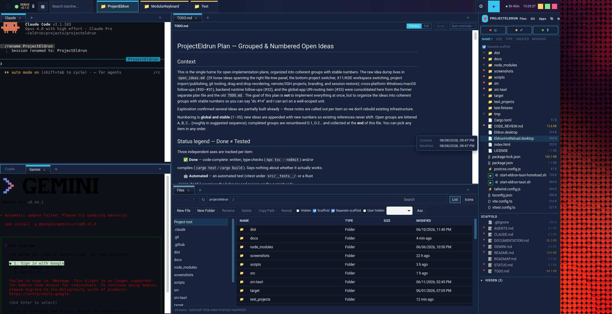

# Eldrun

Eldrun is a desktop orchestration and project-management app built around agent
terminals. It gives each active project its own working context, keeps Claude,
Codex, and plain shell terminals close at hand, and wraps them with project
switching, file browsing, app launching, time tracking, and optional desktop
workspace routing.

The goal is to make AI-assisted development feel less like a pile of terminals
and more like an operational cockpit: one root control terminal for managing the
workspace, one or more agent terminals per project, a persistent project bar, a
hover-revealed file panel, and cross-project app controls that stay available
while you move between projects.

## Vision

Eldrun is intended to become a project-centric desktop layer, not just an app
that launches or embeds other apps. The user-facing model is:

> Select a project -> Eldrun restores that project's working context.

That context should eventually include terminals, files, apps, windows, Git
state, notes, AI/task metadata, layout, and workflow state. The current MVP is
focused on Linux Mint/Cinnamon on X11 because it provides the fastest path to
reliable window control. The longer-term direction is a stable Eldrun core with
desktop/compositor backends for Cinnamon X11, KDE/KWin, Hyprland, GNOME Shell,
i3, Sway, and other Wayland environments.

See [VISION.md](VISION.md) for the full strategy and platform rationale.



```text
+------------------------------------------------------------------+
| network/status        agent + terminal tabs       app shortcuts  |
+------------------------------------------------------------------+
|                                                                  |
| Root/project agent terminal, shell terminal, or embedded app      |
|                                                                  | PROJECT
|                                                                  | file tree
|                                                                  | open windows
+------------------------------------------------------------------+
| Root | Search... | project pills...             | settings | +   |
+------------------------------------------------------------------+
```

## Requirements

- Python 3.11+
- GTK 4, Libadwaita, VTE 3.91
- X11 for app-window embedding, launch-or-raise, sticky app windows, and
  workspace control
- `python-xlib` for X11 window tracking

```bash
# Debian / Ubuntu
sudo apt install python3 python3-gi gir1.2-gtk-4.0 gir1.2-adw-1 \
    gir1.2-vte-3.91 gir1.2-gdkx11-4.0
pip3 install --user python-xlib
```

## Run

```bash
./start-eldrun.sh
```

or:

```bash
cd app && python3 eldrun.py
```

To install the desktop launcher, adjust `Exec=` in `Eldrun.app.desktop` if this
checkout lives somewhere else, then copy it into your local applications folder:

```bash
cp Eldrun.app.desktop ~/.local/share/applications/
update-desktop-database ~/.local/share/applications/
```

## Agent Support

Eldrun launches agents in VTE terminals (or, for Ollama, via a built-in HTTP
dialog). The table below describes the current integration state.

### CLI agents (VTE terminal tabs)

| Agent | Integrated | Tested | Notes |
|-------|-----------|--------|-------|
| **Claude** (`claude`) | Yes | Yes | Default agent command. Full tab lifecycle, task metadata, prompt auto-send, project-scoped sandbox env. |
| **Codex** (`codex`) | Yes | Yes | Selectable as default agent command in Settings. Same tab lifecycle as Claude, including project-scoped sandbox env. |
| **Gemini** (`gemini`) | Yes | Yes | Selectable as default agent command in Settings. Same tab lifecycle as Claude and Codex, including project-scoped sandbox env. |
| **Ollama** (local models) | Partial | Partial | Local models appear in the agent picker; selecting one opens the built-in Ollama dialog instead of a VTE tab. See [Local AI](#local-ai-ollama) below. |
| Mistral CLI | No | No | Not integrated. Would work as a plain shell tab if a CLI exists. |
| Qwen CLI | No | No | Not integrated. |
| Grok CLI | No | No | Not integrated. |
| Other CLI agents | No | No | Any agent with a CLI can be run in a plain shell tab, but Eldrun has no first-class support for it. |

The active agent command (`claude`, `codex`, or `gemini`) is set in Settings. If the
configured command is not found in `$PATH`, Eldrun falls back to the system
shell. Project-bound terminals also receive a best-effort project sandbox: the
child process runs in the project directory with project-local XDG config,
cache, data, state, and temp locations under `<project>/.eldrun/sandbox/`.
The root orchestration terminal keeps the normal Eldrun workspace environment.

### Local AI — Ollama

Eldrun has a built-in Ollama HTTP client (streamed responses, model picker from
`/api/tags`, configurable host and default model). It does **not** run Ollama
models inside a VTE terminal tab — instead it opens a lightweight GTK dialog.
Entry points: `Ctrl+K`, the center inline prompt bar, and the file-tree "Ask
Ollama" context action.

See the [Ollama settings](#settings) section in the documentation for
configuration details.

### Agents not yet integrated

The following cloud APIs and local runtimes are not currently wired into
Eldrun: Mistral, Qwen, Grok, Llama.cpp, and similar tools. They
can always be used manually in a plain shell tab.

## Platform Support

| Platform | Status | Notes |
|----------|--------|-------|
| **Linux — X11 / Cinnamon** | Yes | Fully supported and primary development target. |
| **Linux — X11 / GNOME** | Untested | Expected to work; workspace integration may behave differently. |
| **Linux — Wayland** | No | X11 is required for app-window embedding, launch-or-raise, sticky windows, and workspace control. |
| **Windows** | No | GTK4/VTE stack not supported. |
| **macOS** | No | GTK4/VTE stack not supported. |

## Main Features

- **Agent-terminal orchestration**: create Claude or Codex tabs from the tab bar,
  rename and close them, reorder tabs by drag and drop, and add plain shell
  terminals when an agent is not needed.
- **Root control terminal**: opens in `~/eldrun/root/` with workspace-level
  context files for managing Eldrun and the broader project set.
- **Project terminals**: each active project gets a project-scoped terminal in
  its directory, with best-effort project-local sandbox paths for config,
  cache, data, state, and temp files. The default agent command is
  configurable as `claude` or `codex`, with shell fallback if the command is
  missing.
- **Project creation and import**: the `+` button creates a new git-backed
  project or imports an existing directory by keeping, copying, or moving it.
- **Bottom project bar**: project pills activate, close, search, and reorder
  projects, show warm/open-app state, and expose time/file-type stats.
- **Hover-revealed right file panel**: when the file panel is hidden, a small
  edge control near the upper-right side opens it on hover; the control
  disappears while the panel is open.
- **Project file operations**: browse, open, create, rename, delete,
  color-label, reveal, and inspect project files.
- **Default app mapping**: file extensions can use per-project overrides, global
  defaults, system MIME defaults, or a manual "Open With" picker.
- **App tabs and open windows**: file opens can create app tabs and attempt X11
  embedding; failed embeds are tracked as standalone open windows in the right
  panel.
- **Global app toolbar**: cross-project roles such as Browser, Mail, Calendar,
  File Manager, Password Manager, Notes, Screenshot, and System Monitor can be
  shown as toolbar shortcuts.
- **Launch-or-raise global apps**: global app buttons raise an existing matching
  window when possible, otherwise launch a new instance and mark it sticky across
  workspaces.
- **Region screenshots**: the screenshot global app can launch common screenshot
  tools in interactive region-selection mode.
- **Time tracking and stats**: Eldrun records active project sessions, writes
  summaries into project metadata, and shows stats on project pills.
- **Network indicator**: probes connectivity and shows online/offline plus wired
  or wireless state.
- **Workspace management**: optional Cinnamon, GNOME, or `wmctrl` integration can
  maintain a visible project workspace plus a hidden parking workspace; project
  windows are moved between them on switch, while global app windows stay
  cross-project.
- **Themes and keyboard controls**: settings include Dark, Bright, Fancy Dark,
  Fancy Bright, terminal command, global apps, file-type defaults, and workspace
  management. `F11` toggles fullscreen and `Super` toggles panel visibility.
- **Safer quit flow**: closing Eldrun shows a confirmation dialog and cleans up
  managed workspace state on normal exit.

## Current Limits

- X11 app embedding, launch-or-raise, sticky global windows, and workspace
  control are best-effort and need live desktop-session validation.
- Open-app metadata is stored per project, but robust restart restore,
  geometry/layout restore, and primary-window focus are not complete.
- Wayland does not support the current window manipulation and embedding paths;
  compositor-specific backends are future work.

## Project Storage

Managed projects normally live under `~/eldrun/projects/<sanitized-name>/`.
Imported projects can also be registered in place.

Global Eldrun state lives in `~/.local/share/eldrun/`:

- `projects.json`: lightweight index containing project id, name, status,
  ordering, and the path to each project's local metadata file.
- `settings.json`: terminal command, theme, workspace-management setting, global
  app registry, and other user preferences.
- `default_apps.json`: global file-extension to application command map.
- `time_log.json` and `active_session.json`: session time tracking.

Project-local state lives in each project's `project.json`, alongside scaffolded
files such as `AGENTS.md`, `CLAUDE.md`, `GEMINI.md`, `TODO.md`, `ROADMAP.md`,
`STATUS.md`, and `DOCUMENTATION.md`. Current open-app metadata is stored in
`project.json["open_apps"]`.

See [DOCUMENTATION.md](DOCUMENTATION.md) for the detailed architecture, data
schemas, behavior notes, and known limitations.
