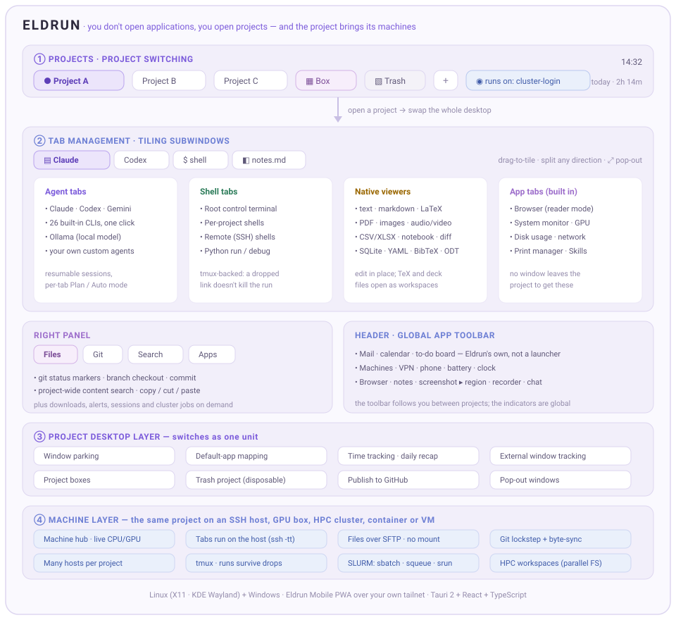
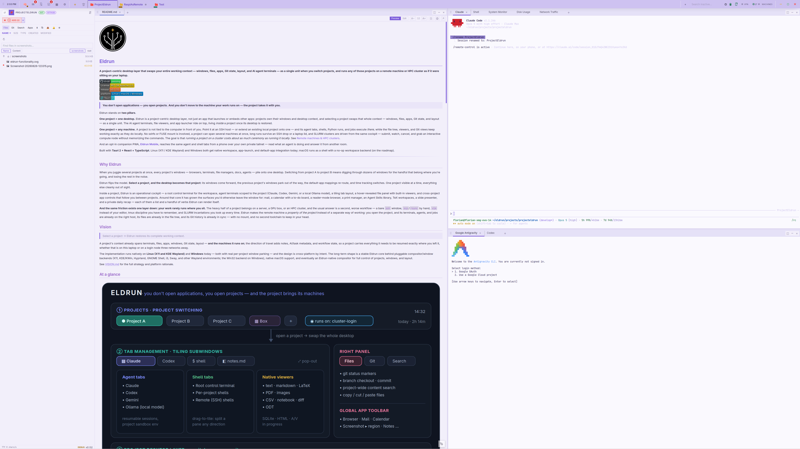

# Eldrun

Current code snapshot: **v0.1.68**, reviewed **2026-09-15**. See
[STATUS.md](STATUS.md) for verification limits and [ROADMAP.md](ROADMAP.md)
for remaining work.

**A project-centric desktop layer that swaps your entire working context — windows, files, apps, Git state, layout, and AI agent terminals — as a single unit when you switch projects, and runs any of those projects on a remote machine or HPC cluster as if it were sitting on your laptop.**

[](https://github.com/fseiffarth/ProjectEldrun/actions/workflows/ci-cd.yml)
[](#license)
[](https://github.com/fseiffarth/ProjectEldrun/releases)


> **You don't open applications — you open projects.**
> **And you don't move to the machine your work runs on — the project takes it
> with you.**
> **And whichever agent you run, you answer it from your phone.**

Eldrun stands on **three pillars**.

**One project = one desktop.** Eldrun is a project-centric desktop layer, not
just an app that launches or embeds other apps: projects own their windows and
desktop context, and selecting a project swaps that whole context — windows,
files, apps, Git state, and layout — as a single unit. The AI agent terminals,
file viewers, and app launcher ride on top, living *inside* a project once its
desktop is restored.

**One project = any machine.** A project is not tied to the computer in front of
you. Point it at an SSH host — or extend an existing local project onto one — and
its agent tabs, shells, Python runs, and jobs execute *there*, while the file
tree, viewers, and Git views keep working exactly as they do locally. No sshfs or
FUSE mount is involved, a project can span several machines at once, long runs
survive an SSH drop or a laptop lid, and SLURM clusters are driven from the same
cockpit — submit, watch, cancel, and grab an interactive compute node without
memorizing the commands. The goal is that *running a project on a cluster costs
about as much ceremony as running it locally*. See
[Remote machines & HPC clusters](#remote-machines--hpc-clusters-the-second-differentiator).

**Every agent = one phone.** An opt-in companion PWA,
**[Eldrun Mobile](#every-agent-from-your-phone-the-third-differentiator)**,
reaches the same agent and shell tabs from a phone over your own private
tailnet — read what an agent is doing and answer it from another room. That is
remote control for **every agent CLI Eldrun runs** — Claude, Codex, Gemini,
Qwen, Grok, Cursor, Copilot, OpenCode and the rest — whether or not its vendor
ships a phone app for it, and without any vendor's relay in between. See
[Every agent from your phone](#every-agent-from-your-phone-the-third-differentiator).

Built with **Tauri 2 + React + TypeScript**. Linux (X11 / KDE Wayland),
Windows, and macOS have native workspace, app-launch, and default-app
integration. Linux X11 is the reference platform; KDE Wayland needs live QA,
and Windows/macOS are CI-built with real-hardware checks still pending
(see the platform table).

---

## Why Eldrun

Are you also annoyed by switching between agent tabs or apps, keeping track of
which tab or agent works on which project? This is why Eldrun exists. When you
juggle several projects at once, every project's windows — browsers, terminals,
file managers, docs, agent sessions — pile onto one desktop. Switching from
project A to project B means digging through dozens of windows for the handful
that belong where you're going, remembering which Claude or Codex tab was
started for which repo, and losing the rest in the noise.

Eldrun flips the model. **Select a project, and the desktop becomes that
project:** its windows come forward, the previous project's windows park out of
the way, the default-app mappings re-route, and time tracking switches. One
project visible at a time, everything else cleanly out of sight. And if you
need to work on two projects at the same time, simply *box* them — the box
behaves like one project with a shared desktop, file tree, and agent tabs —
and unbox afterwards, leaving both projects exactly as they were.

Inside a project, Eldrun is an operational cockpit — a root control terminal for
the workspace, agent terminals scoped to the project (Claude, Codex, Gemini, or
a local Ollama model), a tiling tab layout, a hover-revealed file panel with
built-in viewers, and cross-project app controls that follow you between
projects. Around that core it has grown the surfaces you'd otherwise leave the
window for: mail, a calendar with a to-do board, a reader-mode browser, a print
manager, an Agent Skills library, TeX workspaces, a slide presenter, and a
private daily recap — each of them a list and a handful of verbs Eldrun can
render itself.

**And the same friction exists one layer down: your work rarely runs where you
sit.** The heavy half of a project belongs on a server, a GPU box, or an HPC
cluster, and the usual answer is a second, worse workflow — a bare `ssh` window,
`scp`/`rsync` by hand, `vim` instead of your editor, tmux discipline you have to
remember, and SLURM incantations you look up every time. Eldrun makes the remote
machine a *property of the project* instead of a separate way of working: you
open the project, and its terminals, agents, and jobs are already on the right
host, its files are already in the file tree, and its Git history is already in
sync — with no mount, and no second toolchain to keep in your head.

## Vision

> Select a project → Eldrun restores its complete working context.

A project's context already spans terminals, files, apps, windows, Git state,
layout — **and the machines it runs on**; the direction of travel adds notes,
AI/task metadata, and workflow state, so a project carries everything it needs to
be resumed exactly where you left it, whether that is on this laptop or on a
login node three networks away.

The implementation runs natively on **Linux (X11 and KDE Wayland)**,
**Windows**, and **macOS** — each with per-project window parking in its own
idiom (desktops, `SW_HIDE`, app hide/unhide) — and the design is cross-platform
by intent. The long-term shape is a stable Eldrun core behind pluggable
compositor/window backends (X11, KDE/KWin, Hyprland, GNOME Shell, i3, Sway, and
other Wayland environments; the Win32 backend on Windows; AppKit on macOS), and
eventually an Eldrun-native compositor for full control of projects, windows,
and layout.

See [VISION.md](docs/VISION.md) for the full strategy and platform rationale.

## At a glance



**①** pick a project — or a box, or the disposable trash project — and the
desktop swaps to it. **②** inside, a tiling tab layout hosts agent terminals
(27 built-in CLIs plus your own, with resume support depending on the CLI),
shells, native file viewers, and the app tabs Eldrun renders itself instead of
sending you to another window — every one of those agent tabs is also readable
and answerable from a phone through Eldrun Mobile, whichever vendor it belongs
to. Alongside them sit the side panel (Files · Git
· Search · Apps · Agents) and the header, where mail, the calendar, the to-do board, the
machine hub, and the VPN live next to the global app toolbar. **③** the
project-desktop layer — window parking, default-app mapping, time tracking and
its daily recap, external windows, pop-out tab windows — follows the active
project automatically. **④** and the project carries the machines it runs on:
its tabs, jobs, and files can live on an SSH host, a GPU box, an HPC cluster, a
container, or a VM without changing how any of the above works.

And here's how that looks in the running app:



## How Eldrun compares

Agent orchestrators (Vibe Kanban, Conductor, Claude Squad, the Claude Code
desktop app) manage agent *processes inside a repo* — task delegation, git
worktrees, diff review, merge flow. They are excellent at parallelizing work
within one codebase, but they have no notion of your desktop: they won't move
your windows or switch default apps when you change focus.

Manual approaches cover only one slice each: KDE Activities and one virtual
desktop per project handle windows but have no project model and no restore;
tmux and scripts like `workon` restore terminal layouts but ignore everything
outside the terminal.

Nor do any of them cross machines. Remote development tooling (VS Code Remote,
JupyterHub, a hand-rolled `ssh` + `rsync` + tmux setup) attaches *one editor* to
*one host*; the cluster half — workspaces on the parallel filesystem, `sbatch`
and `squeue`, an `srun` shell on a compute node, keeping several machines in
step — stays a terminal exercise you repeat per project.

The vendor phone apps and remote-control features (Claude Code's remote
control, the Codex app, the Gemini app) each reach *their own* agent, and only
through *their own* relay. An agent from a vendor without one — or the one you
started in a plain terminal — cannot be reached at all. Eldrun Mobile reaches
every agent tab in every project from the phone over your own tailnet, because
it attaches to the tab's session on your desktop rather than to a vendor
service: one phone app for all agents, independent of whether one exists for
that agent. A picture the agent wants you to see — a screenshot it took, a
plot it rendered — it runs `eldrun-send <file>`, and the phone shows it.
Local and container tabs can send any file up to 24 MiB: images open full
screen, text opens a preview, PDFs open a browser tab, and other files download.
Share is available where the phone browser supports file sharing; stdin works
with `command | eldrun-send -n tests.log`.

Eldrun occupies the gap none of them fill: project ownership of *windows and
desktop context*, project ownership of *the machines the work runs on*, and one
phone-side remote for every agent, with
agent terminals built in throughout. It is complementary to the
task orchestrators rather than a replacement — you can run one inside an Eldrun
project terminal for parallel task delegation while Eldrun handles switching the
desktop between projects.

## Stack

- **Frontend:** React 18, TypeScript, Vite, Tailwind CSS, Zustand
- **Terminal UI:** xterm.js (`@xterm/xterm`, `@xterm/addon-fit`, `@xterm/addon-web-links`)
- **Backend:** Rust, Tauri v2
- **PTY:** `portable-pty` crate
- **Companion PWA:** a separate Vite bundle under `mobile-web/`, served by a
  loopback sidecar (built by the same `npm run build`)
- **Workspace:** `zbus` (DBus) and `xcb` (X11) on Linux; the Win32 API
  (`windows` crate — `SW_HIDE`/`SW_SHOW`, `EnumWindows`, virtual-desktop manager,
  shell-link/icon resolution) on Windows

## Download

Prebuilt packages are published on the
[Releases page](https://github.com/fseiffarth/ProjectEldrun/releases). From the
[latest release](https://github.com/fseiffarth/ProjectEldrun/releases/latest),
grab the `.AppImage` (portable Linux) or `.deb` (Debian/Ubuntu), or the `.exe`
installer on Windows, or the unsigned universal Intel/Apple Silicon `.dmg`
on macOS. The CI release workflow publishes each platform whose packaging job
succeeds. To build from source instead, follow the requirements below.

The macOS `.dmg` is neither signed nor notarized, so Gatekeeper refuses to open
the app as downloaded ("damaged" or "cannot be opened"). After dragging Eldrun
into Applications, clear the download quarantine once:

```sh
xattr -dr com.apple.quarantine /Applications/Eldrun.app
```

The Linux packages are built on Ubuntu 24.04, so they need glibc 2.39 or newer
(Ubuntu 24.04+, Debian 13+, Fedora 40+). On an older distro the loader fails
with `GLIBC_2.39 not found` — build from source there instead.

Once it is installed, **Settings → Updates** checks the same releases page from
inside the app and can download and install a newer build for you. It only
looks when you open that screen — Eldrun never checks in the background — and
restarting is always yours to do. A copy installed from the `.deb` (or by any
other package manager) downloads the new build but leaves installing it to you.

## Requirements

- Linux desktop (X11 or KDE Wayland), Windows 10/11, or macOS
- Rust toolchain (`rustup`) and a current Node.js LTS release (matching CI)
- Remote/SSH and HPC projects (optional): nothing to install locally beyond
  OpenSSH — no `sshfs`, no FUSE. On the host: `tmux` for persistent sessions
  (optional), plus `openvpn` locally for VPN-gated hosts
- Containerized projects (optional): Docker. VM projects (optional): QEMU/KVM
- Print manager (optional): CUPS on Linux/macOS — nothing to install on Windows
- Eldrun Mobile (optional): Tailscale on this machine and on the phone
- Local model features — Vibe tabs, autocomplete, grammar check, the mail
  assistant (all optional and off by default): Ollama

```bash
# Install Rust (all platforms): https://rustup.rs

# Linux: Tauri system dependencies (Debian / Ubuntu)
sudo apt install libwebkit2gtk-4.1-dev libssl-dev libgtk-3-dev \
    libayatana-appindicator3-dev librsvg2-dev

# Install JS deps
npm install
```

On Windows the Tauri webview uses the system WebView2 runtime (preinstalled on
Windows 11); no GTK/WebKit packages are needed.
On macOS, install the Xcode command-line tools; the webview uses WKWebView.

## Run

A development build with hot-reload (all platforms):

```bash
npm run tauri:dev
```

Frontend edits hot-reload. This command disables Rust watching, so backend
changes take effect only when you deliberately restart the app. Run
`npm run backend:stale` to compare the running backend and embedded frontend/PWA
with the checkout. `npm run tauri:dev:watch` opts into automatic backend
rebuilds and window relaunches.

On Linux, `npm run package:dev` freezes the working tree for the **Eldrun (dev)**
desktop entry. With this clone's hooks enabled, commits also queue a background
freeze of **the committed snapshot**; `scripts/package-dev-auto.sh --status`
reports the queue or last failure. A running window keeps its current binary
until you relaunch it. For a separate development state directory, launch
`./start-eldrun-dev-sandbox.sh` yourself.

On Linux you can also use the convenience scripts in `docs/`:
`docs/start-eldrun-tauri.sh` (packaged build) and
`docs/start-eldrun-tauri-hotreload.sh` (hot reload). The desktop launchers
`docs/Eldrun.desktop` and `docs/EldrunHotReload.desktop` carry a
`/path/to/projecteldrun/...` placeholder — point them at your checkout, then
install them:

```bash
cp docs/Eldrun*.desktop ~/.local/share/applications/
update-desktop-database ~/.local/share/applications/
```

## Main Features

### Project desktop (the first differentiator)

- **Workspace management**: X11 two-desktop parking model, KDE Wayland
  per-project virtual desktop model, and a Windows `SW_HIDE`/`SW_SHOW` parking
  model (with best-effort virtual-desktop pinning). macOS parks applications
  through hide/unhide. Global app windows stay visible across project switches.
- **External window tracking**: file opens use `xdg-open` (Linux), the shell
  open verb (Windows), or LaunchServices (macOS). Launched apps are tracked and
  shown in the side panel; macOS tracking and parking operate per application.
- **Default app mapping**: file extensions use per-project overrides, global
  defaults, system MIME defaults, or a manual "Open With" picker.
- **Time tracking**: Eldrun records active project sessions and shows today's
  elapsed time on project pills.

### Remote machines & HPC clusters (the second differentiator)

Eldrun treats remote hosts as first-class: it **manages a fleet of machines** and
**runs your projects on them**, from a single SSH box to a full HPC cluster —
with the same file tree, viewers, Git panel, and agent tabs you use locally, and
without an sshfs/FUSE mount anywhere.

- **Machine hub**: register SSH hosts once (independent of any project) in the
  header's machines indicator — see a live CPU/GPU usage bar per machine,
  connect/disconnect, arm silent auto-connect on launch, and drag a machine onto
  a project to attach it as a compute host.
- **Run on the remote host**: a project can point at a host — at creation, or by
  *extending* an existing local project onto one in place — and run its agent,
  shell, and Python tabs *on that host* over `ssh -tt`, with the file tree, Git,
  and in-app viewers all reading the remote tree over SFTP. Everything rides one
  pooled ControlMaster connection per machine, and VPN-gated hosts bring up an
  OpenVPN tunnel first.
- **A local copy that stays in step, on purpose**: the project keeps a local
  mirror kept current by two transports that split the tree by Git. **Git
  lockstep** moves *tracked* files semantically — commits and refs via
  `git bundle`, never `.git` bytes — while an opt-in, per-folder **byte-sync**
  moves everything else. So your editor, agents, and Git history see the project
  locally, while gigabytes of host-side experiment output stay on the host until
  you ask for them; a setup census offers to exclude the giant folders
  (`node_modules/`, `.venv/`, `data/`, `checkpoints/`) up front.
- **Many machines per project**: beyond the primary host, add extra *worker*
  machines — their code is kept in sync from the project (one-way, tracked files
  only) and their experiment outputs are pulled back on demand. A worker on a
  **shared filesystem** (e.g. an HPC compute node on a shared home) is used in
  place, with nothing copied and no Git run on it.
- **Persistent sessions**: a long run lives in a tmux session per shell tab, so
  a job survives an SSH drop, a laptop sleep, a VPN drop, or Eldrun quitting, and
  the tab reattaches on relaunch. A **Sessions view** lists every running session
  across all connected machines, with per-row attach/rename/kill.
- **Remote system monitor**: a host's CPU, memory, and GPUs (AMD + NVIDIA,
  including per-process GPU memory) are sampled over the same SSH connection and
  shown alongside the local machine's.
- **HPC / SLURM** *(built, but untested pending real-cluster QA)*: submit a batch
  script with `sbatch`, watch its live log, list and cancel your queued jobs, and
  open an interactive compute-node shell via `srun` — without memorizing the
  commands. A guided **HPC pipeline wizard** walks a cluster newcomer through
  login → project → data upload → job → watch.
- **HPC workspaces** *(same QA caveat)*: on clusters that hand out scratch space
  on the parallel filesystem via `hpc-workspace`, Eldrun allocates, lists,
  extends, and releases workspaces from the app, and can put the project's remote
  root *in* one — so the data lands off the quota'd `$HOME` before the first byte
  is uploaded. Nothing is site-specific: the host is asked which filesystems and
  limits it offers.

### Every agent from your phone (the third differentiator)

**Eldrun Mobile** is an **opt-in** phone/tablet companion that reaches this
desktop's *agent and shell tabs* — read what an agent is doing and answer it
from another room. It is a compact terminal-control product, not a mobile copy
of the workspace, and it is the same product for every agent CLI: the vendor
does not have to ship a phone app for the agent you are running.

- **Every agent, whether or not its vendor has a phone app.** Any agent tab
  with a resumable session is reachable — Claude, Codex, Gemini, Qwen,
  OpenCode, Copilot, Cursor, Grok, Antigravity, Vibe, or a custom command with
  its own resume arguments — because the phone attaches to the tab's tmux
  session on your desktop rather than to a vendor API. Claude's own
  remote-control feature stays what it is (Claude-only, through Anthropic's
  relay) and is independent of this.
- An **Agents** mode lists every session that is working, waiting on a
  decision, or done, flat across all opted-in projects and waiting-first — the
  one question a phone is picked up to ask. Tapping a row lands in that
  session.
- A loopback-only sidecar on the desktop, published to your own **Tailscale
  tailnet** with `tailscale serve`; there is no public endpoint and no Eldrun
  server in the middle. Devices are paired and authenticated explicitly, and the
  desktop mediates every tab creation.
- Raw project ids, paths, commands, and tmux targets never cross the browser
  API — the sidecar core (`services::mobile_control`) is `AppHandle`-free and
  path-free by construction.
- **Focus** presents a chat view of a session. For Claude and Codex it reads
  stored prompts and answers, with explicit truncation limits; when that record
  is unavailable it falls back to the terminal screen. Model selection,
  scheduled prompts, closing tabs, and the `eldrun-send` file outbox are also
  available from the phone.
- The phone gets a touch terminal (readable-screen mode, touch scrolling, a
  composer, voice input), a to-do board, Alerts with Done actions, opt-in mail
  flag/reply actions, last-tab restore, an offline app shell, and a local lock.
  Project boxes are selectable scopes too. Access is granted **per project**;
  remote and VM projects are excluded, as are containerized ones — with the Trash workspace as the single
  deliberate exception.
- A desktop header control shows host status; Settings carries the opt-in, the
  security-health readout, and one-click terminal setup.

*Host setup is implemented for Linux (systemd user service), macOS (launchd),
and Windows (Run key). Cross-platform and full real-phone security/acceptance QA
remain; some Mobile UI has been live-tested.*

### Project cockpit

- **Agent-terminal orchestration**: create Claude, Codex, Gemini, Muse Code,
  and the other built-in agent CLIs, or plain shell
  tabs from the tab bar; create local Ollama-backed Vibe tabs from installed
  models; rename, close, and reorder them by drag and drop. The `+` menu's
  Agents group is searchable, its quick picks are configurable, and you can
  register your own agent CLI through "＋ Add agent…". Tab layout is persisted
  per project. Settings shows installed CLI versions against the versions
  Eldrun was checked with.
- **Agents view and prompt chart** *(implemented, live QA pending)*: inspect
  each tab's activity, latest prompt, and model from the side panel; open a
  project-scoped chart tab with a zoomable timeline of sent, queued, and
  scheduled prompts. Collect Markdown drafts on a strip or free-position board,
  tag/filter them, select several cards, and link related prompts or ordered
  follow-ups. Prompt history records the answering model when available.
- **Scheduled prompts and chains**: one-time, daily, or selected-weekday rules
  deliver to an idle agent while the desktop app is open. The chart allows one
  independent rule per tab; further prompts can follow through an **after**
  link. Follow-ups wait for the source turn to finish and then stay idle for
  five minutes. Claude/Codex hooks provide turn state when available; other
  agents use a best-effort output/idle fallback. Due schedules have a one-hour
  catch-up window and record missed deliveries. Delivery replaces any unsent
  terminal composer draft, including in a focused tab.
- **Tiling subwindows**: the center panel is a tiling layout — drag a tab onto
  another subwindow's left/right/top/bottom edge to split that direction into a
  new pane, or onto its center to move the tab in. Splits resize with draggable
  dividers, each subwindow keeps its own tab bar, and the whole tree is persisted
  per project. A subwindow's tab bar also offers a **pop-out** button that
  detaches that group into its own borderless OS window; the detached window is
  tracked as a project-owned window and parks/restores with its project on switch.
  Dock it back with the ⤓ button (re-docks into the main layout; session-only, so
  it re-docks on restart too). Closing the popped-out window instead closes its
  tabs for good — they are not docked back and do not restore on next launch.
- **Project boxes (meta-project grouping)**: temporarily join two or more
  projects into a *box* — its own pill in the switcher — for side-by-side file
  work, cross-project copy-paste, PDF merges across members, and box-rooted
  agent tabs. Membership is non-exclusive (a project can sit in several boxes);
  member pills keep rendering individually with a small ▣ badge. Add via the
  pill menu's Boxes group, Ctrl-click multi-select → "Box these…", the box
  editor, or by dropping a pill on a box; a box only ever disappears through
  the editor's explicit, confirmed Dissolve. Opening a box lands in a per-box
  folder under `~/eldrun/boxes/<name>/`, which carries managed
  `CLAUDE.md`/`GEMINI.md`/`AGENTS.md` link blocks plus one symlink per member
  (Unix), so agent CLIs can traverse into every member's tree; hover the pill
  to list members and click one to jump to it. Box membership lives in a
  sibling `boxes.json`, so `projects.json` is untouched. Box tab scopes
  persist and restore like a project's; box tabs run locally, with local agents
  covered by the agent fence and access derived from the box's member roots.
- **Root control terminal**: opens in `~/eldrun/root/` with workspace-level
  context files.
- **Project terminals**: each active project gets a PTY tab scoped to its
  directory, with best-effort project-local XDG sandbox paths.
- **Project creation and import**: the `+` button creates a new git-backed
  project or imports an existing directory (keep in place, copy, or move).
- **Remote (SSH) projects**: optionally point a project at a remote host. Enter
  an SSH address (`user@host[:port]`), connect, and browse the remote filesystem
  in-app to pick the project root — no mount involved: the file tree and file I/O
  go over SFTP, terminal and agent tabs run **on the remote host** over `ssh -tt`
  (multiplexed over a ControlMaster socket), and git runs on the host, with the
  agent CLI auto-detected/bootstrapped there and authenticated with the remote's
  own login. Auth uses your existing SSH setup (keys / agent / `~/.ssh/config`)
  or a password you can optionally save to the OS keychain. See
  [Remote machines & HPC clusters](#remote-machines--hpc-clusters-the-second-differentiator)
  for the fleet, sync, session, and cluster features built on top.
- **Publish to GitHub / GitLab**: a local (or SSH-remote) git project can be
  published to a new GitHub or GitLab repository from the project pill menu.
  Choose the provider and public/private; Eldrun runs `gh repo create …
  --source=. --push` (GitHub) or `glab repo create … --remoteName origin`
  followed by `git push` (GitLab) via the system CLI (over `ssh` on the host
  where the bytes live for remote projects), then records the new push target
  (`git_type` becomes `remote-public`/`remote-private`) and provider. Requires
  the chosen provider's CLI — `gh` or `glab` — installed, with authentication
  from the CLI or a saved token under Settings → Git hosting.
- **Project switcher**: the header's scope picker selects projects, boxes, Root,
  and Trash. Project pills show activity and pending decisions; hover to inspect
  the path, Git state, today's active time, and live CPU%.
- **File side panel**: place it on either side; its closed edge rail opens
  Files, Git, Apps, or Agents on hover or click. Browse, open, create, rename,
  delete, copy/cut/paste, and reveal project files, with a breadcrumb trail and
  per-file git status
  markers (modified, untracked, staged, committed-but-unpushed, ignored). A
  **Git** view shows the current branch, clickable branch pills for checkout,
  and a commit list whose entries open an editable commit-message window (amend
  HEAD, agent-generated messages, or checkout). A **Search** view runs a
  project-wide literal content search and lists matching lines that jump straight
  into the in-app viewer. The panel can be pinned open instead of hover-revealed;
  additional views list tracked external windows.
- **Downloads and project captures**: browse configured download source folders
  in the file panel and move/copy files into a project. Screenshots and saved
  mail attachments use Eldrun-prefixed, ignored project folders; Eldrun does
  not rewrite another browser's preferences or download directory.
- **Local autocomplete (opt-in, private)**: in the editable text/LaTeX/markdown
  viewers, `Ctrl+Space` requests a single completion from a **local Ollama**
  model (`Tab` accepts, `Esc` dismisses). It is OFF by default; each editor tab
  has its own **Autocomplete** toggle + length-mode (Sentence/Block/Scope) in the
  header that overrides the per-type default, so you can enable it just for the
  tab you're in. Nothing is sent anywhere unless you enable it, and if Ollama
  isn't running it fails silently — no remote calls, ever.
- **Local grammar check (opt-in, private)**: the same editable viewers can run a
  **local Ollama** proofreader after a typing pause, underlining spelling (red),
  grammar (blue), and style (green) issues; hover a mark for the explanation and a
  one-click fix. Like autocomplete it is OFF by default with a per-tab **Grammar**
  toggle in the header, and entirely local — no text leaves the machine.
- **Dictionary spell check**: a model-free Hunspell provider checks prose in
  the native editors, with downloadable language dictionaries and a personal
  dictionary; code, TeX commands, and other non-prose regions are skipped.
- **Python run and debug** *(experimental, off by default)*: run or debug a `.py`
  file straight from the viewer — breakpoints, `pdb`, and go-to-definition
  included. The tab opens against the
  interpreter the backend ranks highest (project venv, then the rest); the
  frontend does not second-guess that ranking.
- **Global app toolbar**: cross-project roles — Browser, Password Manager, Video
  Conferencing, Media Player, Notes, Screenshot, Screen Recorder, Chat — with
  launch-or-raise and icon resolution. The Screenshot role launches straight into
  interactive region selection when the configured tool supports it. Mail,
  Calendar, File Manager, System Monitor, and the Print Manager have been retired
  from this bar because Eldrun now renders them itself (see
  [Workspace apps](#workspace-apps)); an existing `settings.json` keeps the
  configured commands, so a role that comes back finds them.
- **Ollama model management**: the Settings Ollama panel shows installed
  models, running CPU/GPU state, parameter and quantization details, plus
  catalog install, update, unload, and delete controls.
- **Hover-revealed panels**: the global app bar and file side panel appear on
  pointer hover and disappear when the pointer leaves, keeping the center
  terminal unobstructed; the side panel can also be pinned permanently open.
- **Appearance and responsiveness**: a Theme Customizer with saved presets,
  keyboard steering and shortcut help, Fast mode, and Energy Saver. Hidden
  viewers suspend background work and hidden terminals buffer output until
  shown. Settings groups less frequently changed controls under Advanced
  options.

### Isolation tiers: container, VM, and the Trash workspace

A project's tabs run in one of four trust tiers, and the tier is a property of
the project rather than a different way of working.

- **Local** — shells and agents run on the host, in the project directory.
- **Containerized** *(local projects, Docker; Docker Desktop on Windows/macOS)*: flip the pill's "run this
  project in a container" toggle and every shell and agent tab `docker exec`s
  into **one** session-lived, capability-dropped container. The project folder
  stays on the host, bind-mounted at its *identical* absolute path — so the file
  tree, git, viewers, and agent session-resume keep reading host bytes, which is
  what makes it a toggle rather than a migration. Closing a tab reaps its
  in-container processes.
- **Remote SSH** — see
  [Remote machines & HPC clusters](#remote-machines--hpc-clusters-the-second-differentiator).
- **Virtual machine** *(chosen at project creation, not toggled later)*: the
  strongest tier. A QEMU/KVM guest boots, exposes SSH on a forwarded loopback
  port, and from there is an ordinary remote project — with **no shared
  filesystem**, an inverted sync posture, and an egress switch. *(Implemented;
  never live-booted.)*
- **Trash** — a permanent, built-in workspace pill for disposable agents you
  don't want anywhere near a real project. It is created and repaired on every
  project-list save, so ordinary project operations cannot archive or weaken it,
  and it is containerized for **all** tabs (not just agents), so a stale shell
  in it can never become a host escape.

Local agent tabs also have a default-on **agent fence**: bubblewrap on Linux
and `sandbox-exec` on macOS, with writable access limited to allowed project
roots and required agent state. An unavailable Linux fence blocks the launch;
Windows reports that no fence is available. Eldrun controls the project's
container and the tab's location (local / primary host / worker). The agent's
permission mode is selected in its own CLI; Eldrun has no Plan/Auto toggle.

### Workspace apps

Roles Eldrun used to hand off to an external app now have in-app surfaces, on
the same reasoning each time: what sits behind the button is a list and a
handful of verbs, and Eldrun can render a list. Where a link still needs an
app — a `mailto:` or `webcal:` from a terminal or the file tree — the router
opens the in-app surface when it is enabled and falls back to your configured
external app when it is not.

**Several of these are experimental and off by default** in a release build —
mail (`mail_client`), the browser (`web_browser`), the deck presenter
(`deck_presenter`), and Python run/debug (`python_run_debug`). Turn them on
under Settings → Experimental; an unset flag
follows debug mode, so they are all on in a development build.

- **Mail** *(IMAP/SMTP)*: a full client over the whole window — folders, message
  list, compose/reply, attachments (saved into the active project by opaque id,
  never by path), and keyword filter rules. Two independent
  encryption tracks: the **local store** is sealed value-by-value with
  XChaCha20-Poly1305, each ciphertext bound to its own row, so a backup or a
  cloud-synced copy carries no readable subject lines; and **OpenPGP**
  (Curve25519 only, by decision) handles what the sender did before the message
  left their machine. Message HTML is sanitized and rendered in a script-less
  sandboxed frame, always in the order *decrypt → parse → sanitize → render*.
  An opt-in **local-model** assistant (Ollama) can summarize or draft — on
  device, or not at all. PDF attachments preview inside the mail pane.
- **Calendar**: month, week/time-grid, and agenda views; drag to create; alarms
  and reminders; `.ics` import (with a review step) and export. **CalDAV
  accounts** sync against a real server — a sync merges by resource URL rather
  than replacing, so a local edit is never silently overwritten. Two-way push
  is opt-in per account, with a conflict dialog; mail and CalDAV accounts can
  also wait for a required VPN before connecting.
- **To-do board**: a Trello-style board of cards in columns, with steps, tags,
  and due dates. The cards *are* the calendar's tasks — one store, not a second
  one — flanked by an agenda rail and an urgent-mail rail.
- **Browser**: a reader-mode tab (text and images, **no scripts**) behind the
  same sanitizer and SSRF guards as mail, with a security chip, a start page,
  and downloads. Settings → Browser can opt into live pages, which open in a
  separate Eldrun webview window with an ephemeral profile and no Eldrun IPC
  privileges. Live pages run scripts; reader mode stays script-free. Opening
  the page in your external browser is also available.
- **Print manager**: every printer this machine knows, its queue, and the verbs
  — pause/resume a printer, cancel a stuck job, send a test page. CUPS on
  Linux/macOS, PowerShell on Windows; read-only by default, and a missing print
  system is reported as a state rather than an error. Native viewers have a
  print preview with copy count and document-specific settings; PDFs support
  `Ctrl+P`, and the preview follows its submitted job through the queue.
- **Agent Skills library**: browse `SKILL.md` catalogs from git sources and
  one-click install a skill into a project's `.claude/skills/` or into the
  machine's personal `~/.claude/skills/`, which every project here sees.
  Claude-only.
- **Deck presenter**: lay slides over a PDF or a LaTeX base, then present with
  speaker notes, a timer, and a second audience display or window.
- **Agent tools for the calendar and the board (MCP)**: an agent opened in the
  root console (`Ctrl+Shift+R`) — a cloud CLI, or a **local Ollama model**
  behind a tool-capable CLI — gets Eldrun's own tools and can manage these
  surfaces for you: "add a calendar entry on Friday at 14:00, one hour",
  "move every event of that calendar into the other one", "put a card on the
  board for project X", "what did I finish this week?". The calendar tools list,
  add, edit, move, and delete events (a CalDAV-backed calendar pushes them as it
  would a dialog edit); the board tools add, edit, complete, reopen, move, and
  delete cards through the same gestures a drag uses; plus read-only sweeps —
  which projects have uncommitted work, what is out of sync with its host, last
  week's time and usage — and "show me" tools that open the mail, calendar, and
  board overlays. **Mail tools are next**; today an agent can only open the
  client. The tools live on a loopback endpoint behind a per-run bearer token
  that is never written to disk, and **no project's agents ever get them**. One
  switch in Settings turns it all off without a restart: new root agents are
  handed nothing and the ones already running are refused.
- **Daily recap**: a private, local-only summary of your day — which agents and
  models you used, prompts asked, shell commands, file churn, commits, and time
  per project. It opens once on the first launch of each day. Nothing leaves the
  machine and nothing is uploaded anywhere.

### Learning the app

- **Guided tour and lessons**: a first-run tour plus ~30 step-by-step lessons
  that anchor onto the real UI — adding a project, arranging tabs, the YAML and
  PDF viewers, TeX workspaces, the presenter, Python run/debug, the browser,
  printing, calendar, the to-do board, mail, the daily recap, installing an
  agent or a local model, the Skills library, project boxes, container and VM
  projects, SSH projects and OpenVPN, extending a local project onto a host,
  compute machines, persistent sessions, the HPC pipeline, and Mobile.
- **Five languages**: every user-facing string goes through one place
  (`src/lib/i18n.ts`) — English, German, Spanish, French, and Italian, with
  English as the source of truth and the fallback.

### In-app file viewers

Drag a file from the tree onto a subwindow's tab bar to open it in a tab; the
viewer is chosen by extension. In-progress types open in the external default
app until they land.

| Viewer | Extensions | Status | Notes |
| ------ | ---------- | ------ | ----- |
| **Text / code** | `.txt` `.toml` `.py` `.rs` `.ts` `.ini` + many more, plus extensionless files like `Dockerfile` | ✅ Shipping | Editable editor: line-number gutter, syntax highlighting, Tab/Shift+Tab indent, undo/redo (`Ctrl+Z`/`Ctrl+Shift+Z`), find (`Ctrl+F`) and find-and-replace (`Ctrl+R`) with match nav + case toggle, save (`Ctrl+S`); unsaved lines marked; non-destructive auto-reload banner; opt-in local autocomplete and grammar check. |
| **Markdown** | `.md` `.markdown` `.mdx` | ✅ Shipping | Rendered preview with an Edit/Preview toggle; links to local files are clickable. Fenced `mermaid` code blocks render as diagrams and `$…$`/`$$…$$` as math (KaTeX with `trust: false`, mermaid script-free). Remote images load only on request. |
| **YAML / JSON** | `.yaml` `.yml` `.json` | ✅ Shipping | Editable structure tree with a Tree/Source toggle: retype a value, rename a key, add a key or list item (with a type picker), reorder, delete. Both of YAML's syntaxes are first-class — block (`key:`) and flow (`{a: 1}`, which is exactly JSON, on one line or spread over many) — and each keeps the style it is written in. The tree edits the file's own text, so comments, quoting and layout survive an edit; it withholds the affordance rather than botch a construct it can't rewrite (anchors, merge keys). Source is the full code editor. |
| **BibTeX bibliography** | `.bib` `.bibtex` | ✅ Shipping (untested) | Card list with a Cards/Source toggle: one card per entry, its `field = {value}` pairs as editable rows. Retype a value, rename a field or the citation key, change the entry type, add or delete a field, delete an entry, add a new entry, copy a citation key. A filter box searches every key, type and field value (a real bibliography is thousands of records), and cards fold individually — both survive reopening the tab. Like the YAML tree it edits the file's own text, so field order, brace-protected `{DNA}` capitalization, `"…"` quoting, alignment and `%` comments survive an edit; a value it can't rewrite safely (a `@string` macro, a `#` concatenation) is shown read-only rather than mangled, and text outside every entry is reported rather than hidden. Duplicate citation keys are flagged. Source is the full code editor. |
| **LaTeX** | `.tex` | ✅ Shipping | Opens as a **single workspace tab per document**: a left sidebar of the main file's `\input` children and graphics switches the center in-tab, and the compiled PDF opens as its own tab tied to the source. Code editor + compile (when a TeX engine is on `PATH`, shell-escape stripped); `\ref`/`\cite` completion from `\label` keys and `.bib` entries; parsed compile errors jump to the line; bidirectional SyncTeX sync across tiled or detached panes. Typeset fragment hover previews and Beamer overlay controls have project-wide toggles; build with `Ctrl+Shift+B`. |
| **PDF** | `.pdf` | ✅ Shipping | Rendered with a themed zoom toolbar. Blacking text out (untested) is a real redaction, not a black rectangle: drag over anything — or search and black out every hit in one click — and saving *rasterises* the pages you marked, so the covered text is gone from the file rather than hidden under a shape that any copy, extract or annotation delete would lift. Only marked pages are flattened; the rest keep their text. Marks are undoable, follow the page if you reorder it, and touch the file only when you confirm the save. |
| **Presentation deck** | `.eldeck.json` | ✅ Shipping (experimental, untested) | Native slide authoring over a PDF or LaTeX base: layered objects, build steps, speaker notes, and PDF export. Present in-tab or across two displays. Behind `deck_presenter`. |
| **Images** | `.png` `.jpg` `.bmp` `.webp` … | ✅ Shipping | Zoom-to-cursor / pan; draggable out as an OS drop source. An **Annotate** overlay adds freehand pen, rectangle, arrow, and text markup with colour/width controls, undo, and clear, then flattens it into a saved copy (`…-annotated.png`, or overwrite for a `.png`). |
| **Animated GIF** | `.gif` | ✅ Shipping | Frame-level transport on top of the image viewer's zoom/pan: play/pause, frame stepping, scrubber, playback speed, loop toggle, frame/delay readout. Decoded in-app (pure LZW decoder), so it works over SFTP too; a GIF the decoder can't handle degrades to the native animated ``. |
| **Table / CSV** | `.csv` `.tsv` | ✅ Shipping | Editable cells and headers, row insertion/deletion, undo/redo, save/autosave, delimiter detection/override, filtering, sorting, and resizable columns. Edits preserve untouched source text, quoting, and line endings; only visible rows are rendered. |
| **Jupyter notebook** | `.ipynb` | ✅ Shipping | Read-only render of cells top-to-bottom — markdown cells, Python-highlighted code cells, and their classified outputs. |
| **Diff / patch** | `.diff` `.patch` | ✅ Shipping | Color-coded add/del rendering that reads in light and dark themes. |
| **OpenDocument Text** | `.odt` | ✅ Shipping | Read-only: unzips the archive and renders `content.xml` to a safe HTML subset (headings, lists, tables, images). |
| **Spreadsheet** | `.xlsx` `.xls` `.xlsm` | ✅ Shipping | Read-only backend reader (calamine) into the sortable/filterable table grid, with a sheet picker. |
| **SQLite** | `.db` `.sqlite` `.sqlite3` | ✅ Shipping | Read-only table browser: table list + paged row grid. |
| **HTML / SVG** | `.html` `.htm` `.svg` | ✅ Shipping | Editable source editor with a sandboxed (no-script) live preview, Preview ⇄ Source toggle. |
| **Audio / video** | `.mp3` `.mp4` `.webm` `.wav` … | ✅ Shipping | Native in-tab `<audio>`/`<video>` player. |

Other office formats (`.docx`, `.pptx`, `.ods`, …) open in their external
default app. Viewer behaviour is configured per file type under **Settings →
Native Viewers**: the per-type autocomplete and grammar-check defaults (each tab
can override them from its header) plus a global autosave switch. The text/LaTeX/Markdown editors carry an `A−`/`A+` text-size control
(`Ctrl` +/−, `Ctrl`+0 to reset; scales the Markdown preview too), persisted
per file type. Every viewer remembers where you left off — editor/PDF scroll
position, PDF/image zoom, and image pan persist per tab, so reopening a file (or
restarting Eldrun) restores your position instead of jumping to the top.

### Agent support

Eldrun launches agents in xterm.js PTY tabs. The table below describes the
current integration state.

#### CLI agents (xterm.js terminal tabs)

| Agent | Resume behavior | Live verification |
| --- | --- | --- |
| **Claude** (`claude`) | Per-tab conversation via session hooks; preserves the CLI-selected permission mode on resume. | Core tab use confirmed; newer resume/activity paths still have open checks. |
| **Codex** (`codex`) | Per-tab conversation via hooks or hook-free binding, including the SQLite session index. | Core tab use confirmed; newer binding/activity paths still have open checks. |
| **Gemini** (`gemini`) | Continues the latest conversation in the directory. | Core tab use confirmed; restore remains less precise than Claude/Codex. |
| **Vibe** (`vibe`) | Continues the latest saved session. | Pending. |
| **Ollama via Vibe** | Isolated per-model `VIBE_HOME`; continue-latest where a resumable tab is available. | Partial. |
| **Qwen, OpenCode, Copilot, Cursor, Grok, Antigravity, Droid** | CLI-specific continue-latest flags. | Pending. |
| **Kiro, Cline, Aider, OpenClaw, Goose, Pi, Plandex, SWE-agent, Mini SWE-agent, Crush, Amp, Kimi, Qoder, Muse Code, Auggie, Kilo Code, Continue.dev, Junie, CodeBuddy** | Launch support; no built-in tab restore path. | Pending. |
| **Custom agents** | Optional resume arguments supplied by the user. | Depends on the command. |
| **Shell** | Respawns an ordinary shell or reattaches its tmux session where configured. | Core tab use confirmed. |

The default agent command is set in Settings, and each new tab can select a
built-in or custom CLI. The agent fence and project runtime tier determine
filesystem access; project-local XDG paths alone are not an isolation boundary.

**Session resume.** Claude and Codex track each tab's own conversation across
restarts. Eldrun installs session hooks keyed by `ELDRUN_TAB_UID`, so a
`/clear` can update the recorded live session. Codex also has hook-free binding,
including its SQLite-backed session index; its hooks may need one-time `/hooks`
trust. Qwen, OpenCode, Copilot, Cursor, Grok, Gemini, Antigravity, and Vibe have
continue-latest restore paths. Those cannot distinguish several conversations
in the same directory as precisely as Claude/Codex. Custom agents can supply
resume arguments; agents without a supported resume path are not restored.

**Permission and activity.** Set permission mode inside the agent CLI. On Claude
resume, Eldrun reapplies the mode its hook recorded to preserve that choice.
Claude/Codex turn hooks also drive working, decision-needed, and finished states;
agents without a hook verdict use terminal-output heuristics.

**Eldrun's tools (MCP).** Agents opened in the root console are the one kind
that get Eldrun's own tools: calendar, to-do board, project sweeps, and the
"open this overlay" verbs (see [Workspace apps](#workspace-apps)). Claude gets
an inline `--mcp-config`, Codex a `-c mcp_servers.eldrun.*` override, and every
other CLI the `ELDRUN_ROOT_MCP_URL`/`ELDRUN_ROOT_MCP_TOKEN` environment — on
the command line, never in the CLI's own config files. Reads are annotated
read-only and writes destructive, so a CLI that asks before tools asks for the
right ones; approval itself stays the CLI's own. Settings has the single
switch, on by default.

**Custom agents.** Any other agent CLI can be registered from "＋ Add agent…" in
the tab menu and then appears in the Agents group like the built-ins.

Local Ollama models are available from the tab `+` menu when Ollama is
installed and reachable. Eldrun can start the Ollama service, list installed
models, and create a `vibe` tab for a selected model. The per-model `VIBE_HOME`
config pins `active_model`, registers the Ollama provider, and disables Vibe
tool calls for local models so local tabs do not mutate global `~/.vibe`
configuration.
For tool-capable models, the local-agent picker also supports Claude Code,
Codex, OpenCode, Droid, and OpenClaw through the installed Ollama/CLI integration,
with availability and model capability checks.

### Platform support

| Platform                  | Status             | Notes                                                                                        |
| ------------------------- | ------------------ | -------------------------------------------------------------------------------------------- |
| **Linux — X11**           | Yes                | Two-desktop workspace parking model (EWMH/xcb). Primary development target.                  |
| **Linux — KDE Wayland**   | Yes                | Per-project virtual desktop model via KWin DBus scripting. KDE 5 and KDE 6 supported.        |
| **Linux — other Wayland** | Partial            | Null backend (no workspace switching, no sticky windows). Terminal and file management work. |
| **Windows**               | Yes (alpha)        | Win32 `SW_HIDE`/`SW_SHOW` parking model (+ best-effort virtual-desktop pinning). Start-Menu app launch with `.lnk`/icon resolution, shell file associations, external-window tracking, OpenVPN, SSH/SFTP remote projects, Claude/Codex agent resume, project containers via Docker Desktop, project VMs via QEMU + WHPX, Eldrun Mobile (Run-key sidecar), in-app browser live pages (deny-all permission handler), DXGI GPU readouts, and a WebView2 renderer crash reporter. No agent fence (no unprivileged sandbox on Windows), no tmux session persistence, no ControlMaster link counters. CI-verified only. |
| **macOS**                 | Yes (unverified)   | App-granular window parking via `NSRunningApplication` hide/unhide (no public per-window API), `.app` scanner, LaunchServices file defaults, Keychain, `caffeinate` presenter inhibitor, `sandbox-exec` agent fence, project containers (Docker Desktop), project VMs via QEMU + HVF (arm64 guests on Apple silicon), Eldrun Mobile (launchd agent), `nettop` SSH-link counters, IOKit GPU readouts. Compiles and tests on the CI macOS runner; not yet exercised on real hardware. |

### Platform and packaging

- **Network indicator**: probes connectivity and shows online/offline plus wired
  or wireless state.
- **Keyboard shortcuts**: `F11` toggles fullscreen; `F9` toggles panels while
  Eldrun is focused. A bare `Super` also toggles panels where the desktop does
  not claim that key (GNOME, KDE, and Windows do).
- **Crash logging**: Rust panic hook appends to `~/.local/share/eldrun/crash.log`.
- **Packaging**: Linux `.deb` and AppImage, Windows NSIS `.exe`, and an unsigned
  universal macOS `.dmg`. CI builds packages on pushes and publishes successful
  platform artifacts on `v*` tags.

## Current Limits

- Live window embedding (frameless reparenting of an external app into a tab) is
  not yet implemented; files render in built-in in-app viewers where available,
  otherwise open in the OS default app (`xdg-open` / shell open) and are tracked
  as external windows.
- KDE Wayland workspace management needs live-session QA.
- macOS parks at *application* granularity (hide/unhide the owning app): a
  single window of a multi-window app cannot be parked on its own, and a
  launched app cannot be placed on a chosen monitor (no public API for
  positioning another app's window).
- Terminal/tab layout is persisted per project and box; shell, file-viewer,
  and supported resumable agent tabs restore on relaunch. An ordinary PTY's
  processes and scrollback do not survive an app exit; tmux-backed sessions
  can survive and reattach. Continue-latest agent restores have the multi-tab
  limits described above.
- Detached subwindows re-dock on restart. Closing a detached window closes its
  tabs; it does not dock them back.
- Non-KDE Wayland compositors fall back to the null backend.
- Remaining office formats (`.docx`, `.pptx`, `.ods`, …) have no native viewer
  yet and open in the external default app.
- **Code-complete does not mean live-verified.** Mail and selected calendar,
  to-do, Mobile, import, and monitor controls have recorded live use. That does
  not validate every path in those subsystems: CalDAV server sync, mail crypto,
  the deck presenter, VM boots, SLURM/HPC, and the newest prompt-chart workflows
  still have open acceptance checks. Features awaiting verification carry an
  *untested* pill; it is removed per item after user confirmation.
- Eldrun Mobile runs its host sidecar on all three desktops (systemd user
  unit, launchd agent, Windows Run key), requires Tailscale on both ends, and
  its real-phone security and acceptance QA is still open.
- Containerized projects are local-only and need Docker (Docker Desktop on
  Windows/macOS, where they have never been run); VM projects need QEMU with
  hardware acceleration (KVM, Hypervisor.framework, or the Windows Hypervisor
  Platform) and have never been booted on any host.
- Windows has no agent fence (there is no unprivileged filesystem sandbox to
  build one on), no tmux-backed local session persistence, and no SSH
  ControlMaster to read link traffic from; each is reported in the UI rather
  than silently skipped.
- The Agent Skills library is Claude-only, with no manifest, versioning, or
  cross-agent generalization — deliberately out of the MVP.

## Project Storage

Managed projects live under `~/eldrun/projects/<sanitized-name>/`.
Imported projects can also be registered in place.

Global Eldrun state lives in `~/.local/share/eldrun/`:

- `projects.json`: lightweight index with project id, name, status, ordering,
  and path to each project's local metadata file.
- `settings.json`: default agent command, theme, workspace-management setting,
  global app registry, and other user preferences.
- `default_apps.json`: global file-extension to application command map.
- `boxes.json`: project-box definitions (id, name, ordered `member_ids`,
  resolved `folder`, relations); kept separate so `projects.json` stays
  byte-compatible.
- `time_log.json` and `time_summary.json`: session time tracking.
- `global_machines.json`: SSH machines registered independently of any project.
- `calendar.json`: events **and** to-do cards — the board and the calendar share
  one store.
- `usage_stats.json`: local-only rolling hour/day counters behind the daily
  recap. Deliberately separate from time, network bytes (`net_usage.json`), and
  git stats, each of which the recap reads at its own source so they cannot
  drift.
- `agent_prompts.json`: collected drafts, prompt history, tags, and links,
  keyed by project/box scope. `agent_tasks.json` holds per-tab schedules and
  delivery receipts; their target bindings are saved with the tab layout.
- `sessions/<project-id>/terminals.json`: **tab layout and open apps live here,
  outside the project tree**, keyed by project id. The copy inside a project
  folder is legacy/export-only and is adopted only on an explicit request — and
  the app list is never adopted, since a folder-supplied list of host commands
  to launch is exactly what moving it guarded against.
- Per-subsystem directories: `mail/` (sealed store), `browser/`, `vm/`,
  `remote-projects/`, `skills_cache/`, and
  `vibe_local/<model-alias>/config.toml` — isolated Vibe configuration for each
  local Ollama model tab.

Project-local state lives in each project's `project.json` (project identity,
remote specs, runtime/container settings, per-project viewer settings),
alongside scaffolded files (created when missing): `AGENTS.md`, `CLAUDE.md`,
`GEMINI.md`, `TODO.md`, `ROADMAP.md`, `STATUS.md`, `README.md`,
`DOCUMENTATION.md`, plus `.gitignore` and `.claude/settings.json`. **`AGENTS.md`
is the canonical one** — it carries the actual template, and `CLAUDE.md` /
`GEMINI.md` are pointers that import it, so guidance is written once instead of
drifting across three files. A scaffold repair upgrades an agent doc still
holding its untouched pre-`AGENTS.md` stub and never touches anything a human
or agent wrote.

See [DOCUMENTATION.md](DOCUMENTATION.md) for the detailed architecture, data
schemas, behavior notes, and known limitations.

## License

Eldrun is dual-licensed under either of

- Apache License, Version 2.0 ([LICENSE-APACHE](LICENSE-APACHE) or
  <http://www.apache.org/licenses/LICENSE-2.0>)
- MIT license ([LICENSE-MIT](LICENSE-MIT) or
  <http://opensource.org/licenses/MIT>)

at your option.

Unless you explicitly state otherwise, any contribution intentionally submitted
for inclusion in the work by you, as defined in the Apache-2.0 license, shall be
dual-licensed as above, without any additional terms or conditions.
