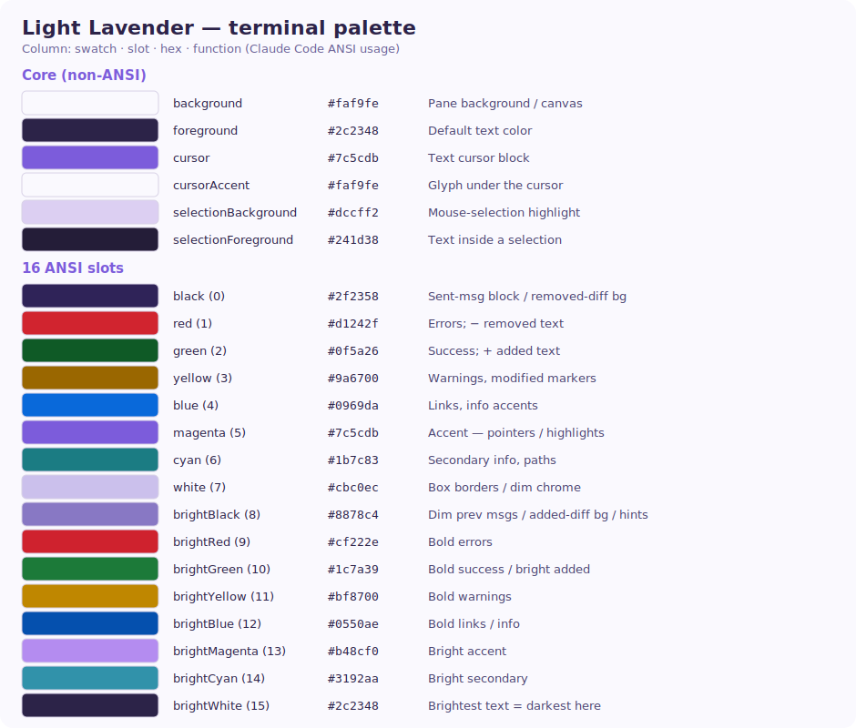

# Light Lavender theme

A light theme with a lavender accent, plus a matching lavender-tinted terminal
palette so the xterm agent/shell terminals (and Claude Code's **ANSI theme**)
read as lavender instead of grey/black.

## Where it lives

| Concern | File |
|---------|------|
| App CSS variables (window/panels/pills/accent) | `src/styles/themes.css` — `[data-theme="light_lavender"]` block |
| Registration in the Settings → Theme picker | `src/types/index.ts` — `Theme` union + `THEMES` array |
| Terminal (xterm) palette | `src/components/terminal/TerminalView.tsx` — `terminalTheme()` `light_lavender` branch + the pane-background ternary |

Adding/adjusting a theme: see the "HOW TO ADD A THEME" comment at the top of the
theme blocks in `themes.css`.

## Terminal palette

The terminal does **not** read the CSS variables — it has its own hardcoded
palette per app theme in `terminalTheme()`. Claude Code, when set to its **ANSI
theme** (`/theme` inside a Claude tab), maps its UI onto these 16 ANSI colors, so
tuning a slot here recolors Claude's message blocks, diffs and chrome.

### Core (non-ANSI)

| Slot | Hex | Function |
|------|-----|----------|
| `background` | `#faf9fe` | Pane background / canvas |
| `foreground` | `#2c2348` | Default text color |
| `cursor` | `#7c5cdb` | Text cursor block |
| `cursorAccent` | `#faf9fe` | Glyph under the cursor block |
| `selectionBackground` | `#dccff2` | Mouse-selection highlight |
| `selectionForeground` | `#241d38` | Text inside a selection |

### 16 ANSI slots

| Slot | Hex | Claude Code usage (inferred) |
|------|-----|------------------------------|
| `black` (0) | `#2f2358` | Sent-message block / removed-diff line bg (dark lavender) |
| `red` (1) | `#d1242f` | Errors; `−` removed text |
| `green` (2) | `#0f5a26` | Success; `+` added text |
| `yellow` (3) | `#9a6700` | Warnings, modified markers |
| `blue` (4) | `#0969da` | Links, info accents |
| `magenta` (5) | `#7c5cdb` | Accent — pointers / highlights |
| `cyan` (6) | `#1b7c83` | Secondary info, paths |
| `white` (7) | `#cbc0ec` | Box borders / dim chrome (light lavender) |
| `brightBlack` (8) | `#8878c4` | Dim previous messages / added-diff bg / hints |
| `brightRed` (9) | `#cf222e` | Bold errors |
| `brightGreen` (10) | `#1c7a39` | Bold success / bright added |
| `brightYellow` (11) | `#bf8700` | Bold warnings |
| `brightBlue` (12) | `#0550ae` | Bold links / info |
| `brightMagenta` (13) | `#b48cf0` | Bright accent |
| `brightCyan` (14) | `#3192aa` | Bright secondary |
| `brightWhite` (15) | `#2c2348` | Brightest text = darkest / max-contrast here |

### Notes

- Slots are **shared**: e.g. `green` colors both diff-added text *and* every
  success message; `black` is both the sent-message block *and* actual black
  output. Tuning a slot for one purpose affects the others.
- The neutral ramp `black → brightBlack → white` is a deliberately wide lavender
  gradient (dark → mid → light) so Claude's emphasized vs dimmed message blocks
  and diff line backgrounds are easy to tell apart.
- Claude Code's **truecolor** themes ignore this palette entirely; only its ANSI
  theme honors it.
